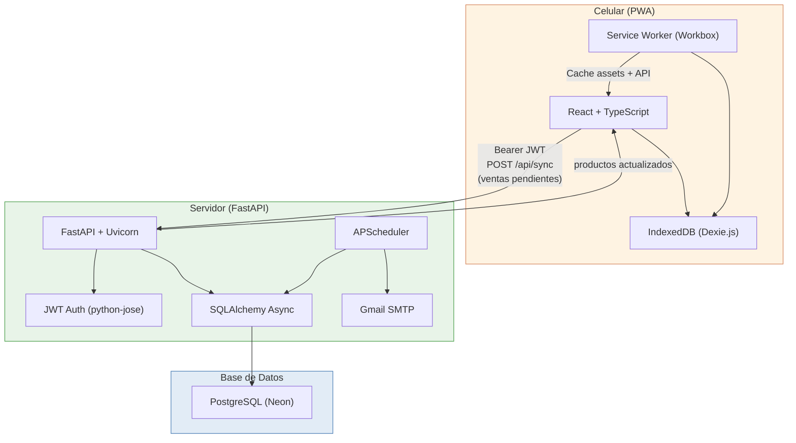
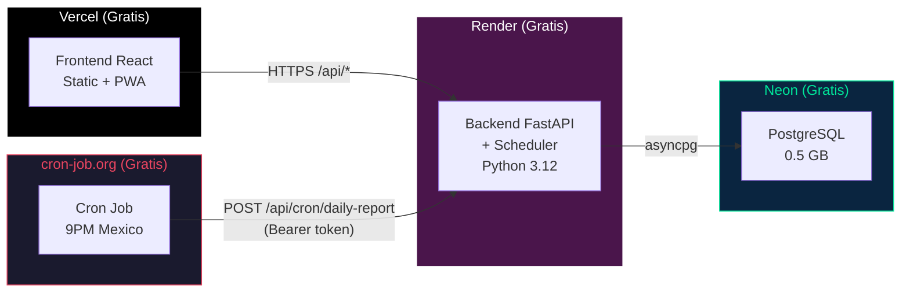
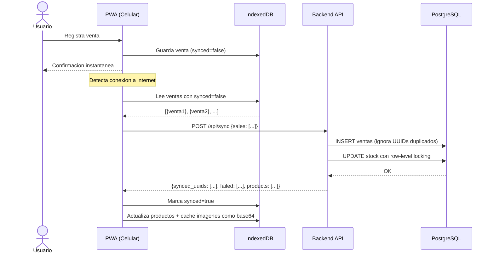
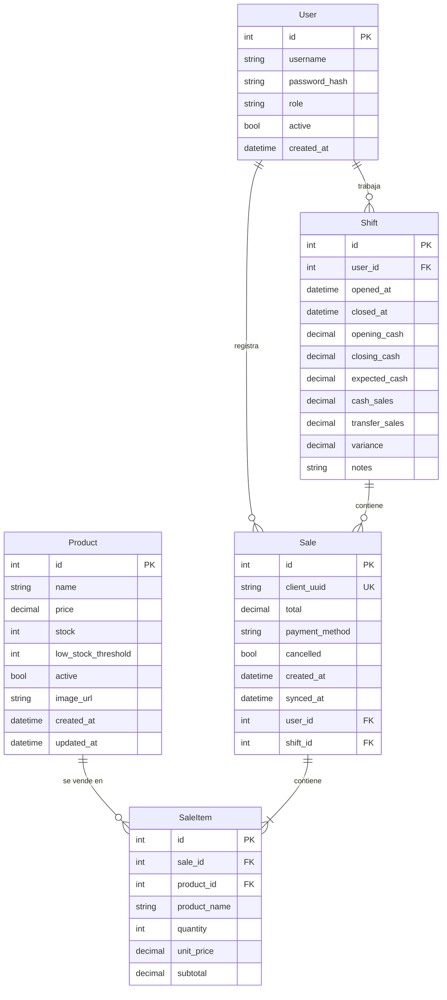

# Sweet Home POS

Sistema de punto de venta para **Sweet Home — Reposteria**.

Aplicacion web movil, offline-first, para registrar ventas diarias de forma rapida desde el celular.

| | URL |
|---|---|
| **App (Frontend)** | https://sweet-home-pos.vercel.app |
| **API (Backend)** | https://sweet-home-pos.onrender.com |
| **API Docs** | https://sweet-home-pos.onrender.com/docs |

---

## Funcionalidades

- Registro de ventas rapido en 3-4 toques
- Descuento automatico de inventario al vender (con row-level locking)
- Funciona sin internet (offline-first con sincronizacion automatica)
- Sistema de autenticacion con roles: **admin** y **empleado**
- Gestion de usuarios (crear, activar/desactivar empleados)
- Gestion de productos y precios desde la app (crear, editar, desactivar)
- Imagenes de productos con subida de archivos y cache offline (base64)
- Anulacion de ventas con restauracion automatica de stock (admin)
- Gestion de turnos con conciliacion de caja (apertura/cierre)
- Resumen diario con totales, productos mas vendidos, desglose por pago (admin)
- Selector de fecha en resumen para consultar dias anteriores
- Historial de ventas: admin ve todas, empleado ve solo las suyas
- Gestion de inventario con alertas de stock bajo
- Indicador de sincronizacion con estado de error y ventas pendientes
- Correo automatico con resumen diario a las 9:00 PM hora Mexico
- Validacion estricta de datos (precios > 0, cantidades > 0, totales verificados)

---

## Roles de Usuario

| Funcion | Admin | Empleado |
|---------|-------|----------|
| Registrar ventas | Si | Si |
| Ver inventario | Si | Si (solo lectura) |
| Ver historial de ventas | Si (todas) | Si (solo las propias) |
| Anular ventas | Si | — |
| Abrir/cerrar turno | Si | Si |
| Ver historial de turnos | Si (todos) | — |
| Resumen del dia | Si | — |
| Crear/editar productos y precios | Si | — |
| Subir imagenes de productos | Si | — |
| Gestionar usuarios | Si | — |

---

## Arquitectura General



**Flujo principal:**
1. El usuario abre la PWA e inicia sesion con usuario + contrasena
2. Abre un turno declarando el dinero en caja
3. Registra ventas que se guardan localmente en IndexedDB
4. Cuando hay internet, la app sincroniza automaticamente con el backend
5. Al terminar, cierra el turno contando el dinero — el sistema calcula si cuadra
6. El backend persiste en PostgreSQL y envia correos diarios

---

## Arquitectura de Deployment



| Servicio | Uso | Limite Free |
|----------|-----|-------------|
| **Vercel** | Frontend estatico + PWA | 100 GB bandwidth/mes |
| **Render** | Backend FastAPI (Python 3.12) | 750 hrs/mes, duerme tras 15 min inactivo |
| **Neon** | PostgreSQL | 0.5 GB storage, 100 compute-hrs/mes |
| **cron-job.org** | Dispara email diario | Ilimitado |

> **Nota:** Render free se duerme tras 15 min sin uso. El cold start tarda ~30-50s. Esto NO afecta el registro de ventas porque la PWA es offline-first. Solo afecta la sincronizacion inicial.

---

## Flujo Offline / Sincronizacion



**Puntos clave:**
- Las ventas se guardan SIEMPRE primero en IndexedDB. Nunca se pierde una venta.
- Cada venta tiene un UUID unico generado en el cliente para evitar duplicados.
- La sync se dispara: al abrir la app, al recuperar conexion, o con boton manual.
- El catalogo de productos se refresca en cada sincronizacion.
- Las imagenes de productos se descargan y cachean como base64 para uso offline.
- El indicador de sync muestra errores y cuenta de ventas pendientes.
- Las ventas que fallan validacion se reportan en `failed[]` con la razon.

---

## Flujo de Turnos / Conciliacion de Caja

```
APERTURA → Empleado ingresa dinero en caja ($500)
  |
TURNO ACTIVO → Se registran ventas normalmente
  |        → Cada venta se vincula al turno abierto
  |
CIERRE → Empleado cuenta dinero y lo ingresa ($2,300)
  |
SISTEMA CALCULA:
  ├─ Ventas efectivo del turno: $1,800
  ├─ Ventas transferencia: $500
  ├─ Esperado en caja: $500 (fondo) + $1,800 (efectivo) = $2,300
  └─ Varianza: $2,300 - $2,300 = $0 (cuadra)
```

---

## Modelo de Datos



---

## Stack Tecnologico

| Componente | Tecnologia | Justificacion |
|------------|-----------|---------------|
| **Backend** | Python 3.12 + FastAPI | Async, rapido, validacion con Pydantic |
| **Autenticacion** | JWT (python-jose) + bcrypt (passlib) | Tokens sin estado, contrasenas seguras |
| **Frontend** | React 18 + Vite + TypeScript | Ecosistema maduro, vite-plugin-pwa para offline |
| **BD Produccion** | PostgreSQL (Neon) | Free tier, compatible con SQLAlchemy async |
| **BD Local Dev** | SQLite + aiosqlite | Cero infraestructura, un archivo |
| **BD Offline** | IndexedDB (Dexie.js) | Queries tipo SQL sobre IndexedDB, sync queue |
| **PWA/Offline** | vite-plugin-pwa + Workbox | Service Worker automatico, cache de assets |
| **Email** | smtplib + Gmail App Password | Stdlib Python, 1 correo/dia, cero costo |
| **Scheduler** | APScheduler (in-process) | Cron interno en FastAPI |
| **CSS** | CSS custom mobile-first | Sin frameworks pesados, touch targets grandes |

---

## Estructura de Carpetas

```
sweet_home_pos/
├── backend/
│   ├── app/
│   │   ├── main.py                 # FastAPI app, lifespan, CORS, migraciones, routers
│   │   ├── config.py               # Settings con pydantic-settings (.env)
│   │   ├── database.py             # SQLAlchemy async engine (SQLite o PostgreSQL)
│   │   ├── seed.py                 # Seed del catalogo de productos
│   │   ├── models/
│   │   │   ├── user.py             # Modelo User (auth)
│   │   │   ├── product.py          # Modelo Product (con image_url)
│   │   │   ├── sale.py             # Modelos Sale + SaleItem (con cancelled, shift_id)
│   │   │   └── shift.py            # Modelo Shift (apertura/cierre de caja)
│   │   ├── schemas/
│   │   │   ├── auth.py             # LoginRequest, TokenResponse, UserCreate, UserResponse
│   │   │   ├── product.py          # ProductCreate, ProductUpdate, ProductResponse (validados)
│   │   │   ├── sale.py             # Schemas de ventas (con validadores gt=0, ge=0)
│   │   │   ├── sync.py             # SyncRequest/Response (con failed_uuids)
│   │   │   └── shift.py            # ShiftOpen, ShiftClose, ShiftResponse
│   │   ├── routers/
│   │   │   ├── auth.py             # POST /login, GET /me, CRUD usuarios, dependencias JWT
│   │   │   ├── products.py         # CRUD productos + subida de imagenes
│   │   │   ├── sales.py            # Crear/listar/anular ventas (con row-level locking)
│   │   │   ├── reports.py          # GET resumen diario (solo admin)
│   │   │   ├── sync.py             # POST sync batch con failed reporting
│   │   │   └── shifts.py           # Abrir/cerrar turnos, historial
│   │   ├── services/
│   │   │   ├── auth_service.py     # hash, verify, create_token, decode_token
│   │   │   ├── email_service.py    # Gmail SMTP + template HTML
│   │   │   ├── report_service.py   # Datos del resumen diario (excluye anuladas)
│   │   │   └── scheduler.py        # APScheduler cron (9PM Mexico)
│   │   └── uploads/products/       # Imagenes subidas de productos
│   ├── .python-version
│   └── requirements.txt
├── frontend/
│   ├── public/icons/               # Logo + iconos PWA
│   ├── src/
│   │   ├── App.tsx                 # Router + AuthProvider + roles + sync indicator
│   │   ├── contexts/
│   │   │   └── AuthContext.tsx     # Auth state, login/logout, token en localStorage
│   │   ├── db/
│   │   │   ├── database.ts         # Schema Dexie.js v4 (products con image_data)
│   │   │   └── sync.ts             # Sincronizacion + cache de imagenes offline
│   │   ├── hooks/
│   │   │   └── useOnlineStatus.ts  # Online/offline + sync con useRef lock + error state
│   │   ├── services/
│   │   │   └── api.ts              # Fetch wrapper con JWT + check expiry pre-request
│   │   ├── pages/
│   │   │   ├── Login.tsx           # Pantalla de inicio de sesion
│   │   │   ├── RegisterSale.tsx    # Registrar venta (con aviso de turno)
│   │   │   ├── Inventory.tsx       # Stock + crear/editar productos + subida de imagenes
│   │   │   ├── SalesHistory.tsx    # "Mis Ventas" / "Historial" + anulacion
│   │   │   ├── DailySummary.tsx    # Resumen con selector de fecha + imprimir
│   │   │   ├── Users.tsx           # Gestion de usuarios (admin)
│   │   │   └── Shifts.tsx          # Abrir/cerrar turno + historial (admin)
│   │   ├── components/
│   │   │   ├── BottomNav.tsx       # Navegacion inferior (6 tabs segun rol)
│   │   │   ├── ProductGrid.tsx     # Grid con imagenes + fallback offline
│   │   │   ├── SyncIndicator.tsx   # Estado: online/offline/syncing/error + pendientes
│   │   │   └── Toast.tsx           # Notificaciones toast
│   │   └── styles/
│   │       ├── global.css          # Reset + variables CSS + tema + print styles
│   │       ├── pages.css           # Estilos por pagina (login, venta, turnos, etc.)
│   │       └── components.css      # Estilos de componentes (grid, nav, sync bar)
│   ├── index.html
│   ├── vite.config.ts              # PWA config + sourcemap disabled
│   └── package.json
├── .gitignore
└── README.md
```

---

## API Endpoints

Base URL: `https://sweet-home-pos.onrender.com` (produccion) o `http://localhost:8000` (local)

Todos los endpoints (excepto `/api/health` y `/api/auth/login`) requieren header:
```
Authorization: Bearer <token>
```

### Health

| Metodo | Ruta | Auth | Descripcion |
|--------|------|------|-------------|
| GET | `/api/health` | — | Health check |

### Autenticacion

| Metodo | Ruta | Auth | Descripcion |
|--------|------|------|-------------|
| POST | `/api/auth/login` | — | Login. Retorna `{token, user_id, username, role}` |
| GET | `/api/auth/me` | Usuario | Datos del usuario autenticado |
| GET | `/api/auth/users` | Admin | Listar todos los usuarios |
| POST | `/api/auth/users` | Admin | Crear usuario. Body: `{username, password, role}` |
| PUT | `/api/auth/users/{id}/active` | Admin | Activar/desactivar usuario. Query: `?active=true/false` |

### Productos

| Metodo | Ruta | Auth | Descripcion |
|--------|------|------|-------------|
| GET | `/api/products` | Usuario | Listar productos. Query: `?active_only=true` |
| POST | `/api/products` | Admin | Crear producto |
| PUT | `/api/products/{id}` | Admin | Editar producto (nombre, precio, umbral, imagen, activo) |
| PUT | `/api/products/{id}/stock` | Admin | Actualizar stock (requiere conexion) |
| GET | `/api/products/low-stock` | Usuario | Productos con stock bajo el umbral |
| POST | `/api/products/upload-image` | Admin | Subir imagen (JPG/PNG/WebP/GIF, max 5 MB) |

### Ventas

| Metodo | Ruta | Auth | Descripcion |
|--------|------|------|-------------|
| POST | `/api/sales` | Usuario | Crear venta (valida total vs items, verifica stock con lock) |
| GET | `/api/sales` | Usuario | Historial. Admin ve todas, empleado solo las suyas |
| GET | `/api/sales/count` | Usuario | Contar ventas con filtros |
| DELETE | `/api/sales/{id}` | Admin | Anular venta (soft delete, restaura stock) |

### Turnos

| Metodo | Ruta | Auth | Descripcion |
|--------|------|------|-------------|
| POST | `/api/shifts/open` | Usuario | Abrir turno. Body: `{opening_cash: 500}` |
| POST | `/api/shifts/{id}/close` | Usuario | Cerrar turno. Body: `{closing_cash: 2300, notes?}` |
| GET | `/api/shifts/me/current` | Usuario | Turno abierto actual (o null) |
| GET | `/api/shifts` | Admin | Historial de turnos. Query: `?date_from&date_to&user_id` |

### Sincronizacion

| Metodo | Ruta | Auth | Descripcion |
|--------|------|------|-------------|
| POST | `/api/sync` | Usuario | Batch de ventas offline. Retorna `{synced_uuids, failed, products}` |

### Reportes (Admin)

| Metodo | Ruta | Auth | Descripcion |
|--------|------|------|-------------|
| GET | `/api/reports/daily` | Admin | Resumen del dia. Query: `?date=YYYY-MM-DD` |
| POST | `/api/reports/send-test` | Admin | Enviar correo de prueba |

### Cron Externo

| Metodo | Ruta | Auth | Descripcion |
|--------|------|------|-------------|
| POST | `/api/cron/daily-report` | Bearer CRON_SECRET | Dispara envio de email diario |

---

## Variables de Entorno

### Backend (`backend/.env`)

| Variable | Default | Descripcion |
|----------|---------|-------------|
| `DATABASE_URL` | `sqlite+aiosqlite:///./sweet_home.db` | SQLite para local, `postgresql+asyncpg://...` para produccion |
| `JWT_SECRET` | `changeme-...` | Secret para firmar tokens JWT. **Cambiar en produccion.** |
| `JWT_EXPIRE_HOURS` | `8` | Duracion del token en horas |
| `ADMIN_USERNAME` | `admin` | Usuario del administrador creado al iniciar |
| `ADMIN_PASSWORD` | `""` | Contrasena del admin. Si esta vacia, no se crea el admin. |
| `GMAIL_USER` | `""` | Cuenta Gmail para enviar correos |
| `GMAIL_APP_PASSWORD` | `""` | App Password de Gmail (16 caracteres, sin espacios) |
| `EMAIL_RECIPIENT` | `""` | Email que recibe el resumen diario |
| `TIMEZONE` | `America/Mexico_City` | Zona horaria para reportes |
| `DAILY_REPORT_HOUR` | `21` | Hora del correo diario (9 PM) |
| `DAILY_REPORT_MINUTE` | `0` | Minuto del correo diario |
| `CORS_ORIGINS` | `http://localhost:5173` | URLs permitidas (separadas por coma) |
| `CRON_SECRET` | `""` | Token Bearer para el endpoint de cron externo |

### Frontend (`frontend/.env`)

| Variable | Default | Descripcion |
|----------|---------|-------------|
| `VITE_API_URL` | `http://localhost:8000` | URL del backend |

---

## Setup Local (Desarrollo)

### Requisitos

- Python 3.12
- Node.js 18+
- npm 9+

### 1. Clonar

```bash
git clone https://github.com/ArturoFrancoMozqueda/sweet_home_pos.git
cd sweet_home_pos
```

### 2. Backend

```bash
cd backend
python -m venv venv

# Activar (Windows PowerShell)
.\venv\Scripts\Activate.ps1
# Activar (Linux/Mac)
source venv/bin/activate

pip install -r requirements.txt
cp .env.example .env
```

Editar `backend/.env` — minimo poner `ADMIN_PASSWORD`:
```
ADMIN_PASSWORD=tupassword
```

### 3. Frontend

```bash
cd frontend
npm install
```

### 4. Ejecutar

**Terminal 1 — Backend:**
```bash
cd backend
uvicorn app.main:app --reload --host 0.0.0.0 --port 8000
```

**Terminal 2 — Frontend:**
```bash
cd frontend
npm run dev
```

### 5. Acceder

- **App:** http://localhost:5173
- **API Docs:** http://localhost:8000/docs

---

## Como Usar la App

### Iniciar sesion
1. Abre la app → login con usuario y contrasena
2. Admin ve: Venta, Inventario, Historial, Turnos, Resumen, Usuarios
3. Empleado ve: Venta, Inventario, Mis Ventas, Turnos

### Abrir turno
1. Ve a "Turnos"
2. Ingresa la cantidad de dinero en caja
3. Toca "Abrir Turno"
4. En la pantalla de Venta aparecera un aviso si no tienes turno abierto

### Registrar una venta
1. Pantalla "Venta" → toca productos para agregar al carrito
2. Usa +/- para ajustar cantidades
3. Selecciona metodo de pago (Efectivo o Transferencia)
4. Toca "Registrar $XX"
5. La venta se vincula automaticamente a tu turno abierto

### Cerrar turno
1. Ve a "Turnos" → tu turno activo muestra el tiempo transcurrido
2. Toca "Cerrar Turno"
3. Cuenta el dinero en caja e ingresa el monto
4. El sistema muestra: esperado vs contado y la varianza
5. Verde = cuadra, Rojo = faltante, Naranja = sobrante

### Anular una venta (admin)
1. Ve a "Historial" → encuentra la venta
2. Toca el icono de basura → confirma "Si"
3. La venta se marca como anulada y el stock se restaura

### Gestionar productos (admin)
1. Ve a "Inventario"
2. **Nuevo:** boton "+ Nuevo" → llena nombre, precio, stock, imagen
3. **Editar:** icono de lapiz → cambia datos o sube nueva imagen
4. Ajusta stock con +/- (requiere conexion)

### Ver resumen del dia (admin)
- "Resumen" → total vendido, top productos, desglose por pago
- Usa el selector de fecha para ver dias anteriores
- Boton "Imprimir" genera version imprimible

### Instalar como app (PWA)
- **Android (Chrome):** Menu → "Agregar a pantalla de inicio"
- **iPhone (Safari):** Boton compartir → "Agregar a inicio"

---

## Proximos Pasos

- Sistema de descuentos (porcentaje o monto fijo por venta)
- Reembolsos parciales (devolver items individuales)
- Categorias de productos con tabs de filtro
- Busqueda de productos en la pantalla de venta
- Generacion de recibos (compartir/imprimir)
- Reportes semanales y mensuales
- Exportacion a CSV de ventas e inventario
- Precio de costo y margen de ganancia por producto
- Pedidos anticipados (pasteles, catering)
- Cambio de contrasena desde la app
- Programa de lealtad para clientes
- Alembic para migraciones de BD formales
